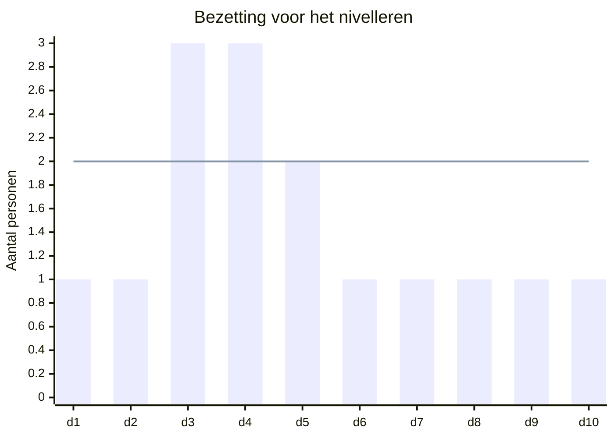
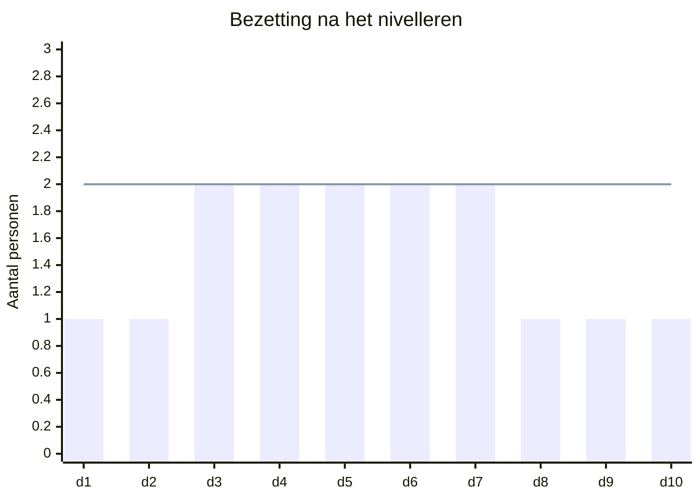

| Projectmanagement | © Hogeschool PXL                                                                                                         |
| ----------------- | ------------------------------------------------------------------------------------------------------------------------ |
| **OLOD**          | 42TIN1250 Projectmanagement                                                                                              |
| **Opleiding**     | Professionele bachelor in de Toegepaste informatica                                                                      |
| **Departement**   | [PXL-Digital](https://www.pxl.be/digital)                                                                                |
| **Lectoren**      | [Lowie Vangaal](https://www.linkedin.com/in/lowievangaal/), [Jan Castermans](https://www.linkedin.com/in/jancastermans/) |

## Inleiding

In het vorige hoofdstuk zag je dat projectmanagement verloopt via vijf procesgroepen. De [[001 Wat is Projectmanagement#Planning Process Group|Planning Process Group]] is daarin het zwaartepunt. In die fase werk je de scope uit het [[001 Wat is Projectmanagement#Plan van Aanpak|Plan van Aanpak]] uit tot een concreet plan waarmee je het project kunt sturen. Dit hoofdstuk gaat verder op dat punt. We zoomen in op de kern van die planning: hoe breng je een project in de tijd in kaart, en hoe bewaak je die tijdlijn?

> [!note] DEFINITIE: Projectplanning
> Een projectplanning is een hulpmiddel om de voortgang en de resultaten van een project te bewaken en te sturen. Een projectplanning is niet hetzelfde als een projectplan (het [[001 Wat is Projectmanagement#Plan van Aanpak|Plan van Aanpak]] uit hoofdstuk 1). Dat projectplan legt de scope en de doelstellingen vast. Kort gezegd: het projectplan zegt _wat_ en _waarom_, de projectplanning zegt _wanneer_ en _in welke volgorde_.

Een volledige projectplanning raakt meerdere dimensies: scope, fasering, tijd, geld en informatie. Een aantal daarvan krijgt verderop een eigen hoofdstuk. Geld en rendement komen aan bod in [[005 Kosten en Batenanalyse|Kosten- en batenanalyse]] (hoofdstuk 5), onzekerheid in [[006 Risicomanagement|Risicomanagement]] (hoofdstuk 6) en communicatie in [[009 Informatiemanagement|Informatiemanagement]] (hoofdstuk 9). In dit hoofdstuk richten we ons op de **tijdsdimensie**. Dat is de ruggengraat waar je alle andere aspecten aan ophangt.

Daarvoor gebruiken we twee klassieke technieken die elkaar aanvullen:

- **PERT (netwerkplanning)** toont de logische samenhang en de afhankelijkheden tussen activiteiten. Daarmee bereken je het **kritieke pad**: de reeks activiteiten die de minimale projectduur bepaalt.
- **De Gantt-grafiek** zet diezelfde activiteiten op een tijdschaal. Zo zie je in één oogopslag wanneer wat loopt, en kun je de voortgang opvolgen.

Je kunt beide met de hand opstellen. In de praktijk gebruik je meestal projectplanningssoftware. Die helpt om alle aspecten van een project in kaart te brengen, te visualiseren en te beheren. [[@kypproject_2023]] [[@teamleader_2018]]

## PERT

> [!note] DEFINITIE: PERT
> PERT (Program Evaluation and Review Technique) is een hulpmiddel voor de bedrijfsleiding bij de analyse en planning van projecten. Hierbij wordt gebruik gemaakt van een grafische voorstelling, het netwerk, om de samenhang tussen de verschillende werkzaamheden aan te geven. [[@schegget.hamelink_1993]]

**Projecten bestaan uit verschillende activiteiten.** Sommige activiteiten moeten achtereenvolgens worden uitgevoerd, terwijl andere parallel kunnen lopen. Vaak wordt de totale duur van een project bepaald door een reeks opeenvolgende activiteiten. Als de tijd voor deze _kritieke_ activiteiten verkort kan worden, is het hele project eerder af. Andere activiteiten hebben een flexibele doorlooptijd en beïnvloeden de totale projectduur niet.

**Netwerkplanning biedt belangrijke voordelen:**

- **Voortgangscontrole:** Je houdt overzicht over de vorderingen.
- **Betere communicatie:** Het netwerk visualiseert afhankelijkheden en verantwoordelijkheden.
- **Bottlenecks opsporen:** Je identificeert snel knelpunten in het proces.

> [!INFO] Geschiedenis
> De PERT methode is uitgevonden door de United States Department of Defense's US Navy Special Projects Office in 1958 als een onderdeel van het Polaris project. De PERT methode lijkt sterk op de kritieke pad methode. Bij de kritische pad methode wordt uitgegaan van de gesommeerde duur van het kritieke pad, terwijl in de PERT methode een kansberekening wordt toegepast.
> [[@geeksforgeeksDifferencePERT2025]]

### Hoofdbegrippen

Een PERT-netwerk bouw je op met een klein aantal bouwstenen. Voor je een netwerk kunt tekenen of lezen, moet je deze begrippen kennen. Hieronder bespreken we ze één voor één, telkens met de manier waarop je ze in een diagram voorstelt.

#### Knooppunt

Een knooppunt stelt een gebeurtenis voor: het moment waarop een activiteit begint of eindigt. Het markeert dus een punt in de tijd, geen werk.

- Neemt geen tijd, arbeid of grondstoffen in beslag
- Wordt voorgesteld door een cirkel

#### Activiteit

Een activiteit is de uitvoering van een taak. Anders dan een knooppunt kost een activiteit wél tijd en middelen.

- Heeft mensen, materialen, hulpmiddelen en tijd nodig
- Wordt voorgesteld door een pijl tussen twee knooppunten
- De lengte van de pijl zegt niets over de duur van de activiteit

#### Netwerk

Een netwerk brengt alle activiteiten en hun volgorde samen in één tekening. Zo zie je hoe de activiteiten van elkaar afhangen.

- Toont de logische opeenvolging van de activiteiten
- Maakt duidelijk welke activiteiten elkaar voorafgaan, volgen of tegelijk lopen

#### Wachttijd

Een wachttijd is een periode waarin het project niet vooruitgaat door eigen werk, maar waarin je toch moet wachten voor je verder kunt. Er verstrijkt tijd, maar je zet er geen mensen of middelen op in. Strikt genomen is dit een gewone activiteit, alleen zonder inzet van mensen of middelen.

- Ontstaat door een natuurlijk proces (bijvoorbeeld verf die droogt of beton dat uithardt) of door afspraken met derden (bijvoorbeeld wachten op een levering of een goedkeuring)
- Neemt alleen tijd in beslag, geen mankracht of hulpmiddelen

#### Schijnactiviteit

Een schijnactiviteit (ook _relatielijn_, _0-lijn_ of _dummy activity_ genoemd) geeft een noodzakelijk verband tussen twee knooppunten aan, zonder dat er tijd of werk aan verbonden is. Ze is vooral handig om tekenproblemen op te lossen wanneer je de afhankelijkheden anders niet correct in beeld krijgt.

- Geeft een noodzakelijk verband aan
- Neemt geen tijd, mankracht of hulpmiddelen in beslag
- Wordt voorgesteld door een stippellijn met een 0 tussen twee knooppunten

Voor een goede uitleg, zie volgende filmpjes

	<iframe src="https://pxl.cloud.panopto.eu/Panopto/Pages/Embed.aspx?id=33b773cd-3e9d-42df-ae3d-b45700dc2886&autoplay=false&offerviewer=true&showtitle=false&showbrand=false&captions=false&interactivity=all" style="border: 1px solid #464646; position: absolute; top: 0; left: 0; width: 100%; height: 100%; box-sizing: border-box;" allowfullscreen allow="autoplay" aria-label="Panopto Embedded Video Player" aria-description="Dummy-Activity-in-Network-Diagram-Projec_Media_ChF6FkW4I6c_001_1080p"></iframe>

	<iframe src="https://pxl.cloud.panopto.eu/Panopto/Pages/Embed.aspx?id=fa07059a-26b2-4d1d-93c1-b45700de1254&autoplay=false&offerviewer=false&showtitle=false&showbrand=false&captions=false&interactivity=all" style="border: 1px solid #464646; position: absolute; top: 0; left: 0; width: 100%; height: 100%; box-sizing: border-box;" allowfullscreen allow="autoplay" aria-label="Panopto Embedded Video Player" aria-description="Dummy-Activities_Media_J2YJwGa4rsc_001_720p"></iframe>

##### Handig referentieschema

Met deze bouwstenen kun je elk project als een netwerk tekenen. Let vooral op het verschil tussen een wachttijd en een schijnactiviteit: een wachttijd kost wel tijd maar geen werk, terwijl een schijnactiviteit een noodzakelijk verband legt zonder dat er tijd of werk aan verbonden is. Zodra het netwerk volledig is, kun je de volgende stap zetten: bepalen hoeveel tijd elke activiteit nodig heeft.

### Tijdsfactor

Zodra het netwerk er staat, bepaal je hoeveel tijd elke activiteit nodig heeft. In de praktijk ken je die duur zelden op voorhand exact. Daarom werkt PERT met drie schattingen per activiteit:

1. t$_o$ = optimistische schatting (most optimistic time): alles loopt vlot
2. t$_l$ = meest waarschijnlijke schatting (most likely time): de duur die je in normale omstandigheden verwacht
3. t$_p$ = pessimistische schatting (most pessimistic time): er loopt veel tegen

Uit die drie schattingen bereken je de verwachte tijd t$_e$:

$t_e= \frac{(t_o+ 4t_l + t_p)}{6}$

> [!tip] Waarom telt de meest waarschijnlijke schatting zwaarder?
> De formule is een **gewogen gemiddelde**. Elke schatting krijgt een gewicht: de optimistische telt 1 keer mee, de meest waarschijnlijke 4 keer, en de pessimistische 1 keer. Samen is dat 1 + 4 + 1 = 6, en daarom deel je door 6.
>
> De meest waarschijnlijke duur krijgt het grootste gewicht omdat dat de uitkomst is die in de praktijk het vaakst voorkomt. De optimistische en de pessimistische duur zijn uitersten die je zelden haalt: ze begrenzen de schatting, maar bepalen ze niet. Door de middelste waarde 4 keer mee te tellen, ligt t$_e$ dicht bij die waarde en schuift ze alleen een beetje op naar de kant waar de meeste ruimte zit.
>
> Vergelijk het met een gewoon gemiddelde: dan zou er $(t_o + t_l + t_p)/3$ staan en zou elke schatting even zwaar tellen. De 4 en de 6 zorgen er net voor dat de meest waarschijnlijke schatting de uitkomst domineert, terwijl de twee uitersten ze licht bijsturen.

Nu elke activiteit een verwachte duur t$_e$ heeft, kun je het netwerk analyseren. Dat gebeurt in twee gangen: eerst voorwaarts (de vroegste tijdstippen), daarna achterwaarts (de laatste tijdstippen). Daarna bereken je de speling en bepaal je het kritieke pad.

### Verwachte tijdstippen

Bij elk knooppunt berekenen we twee tijdstippen: het vroegst mogelijke en het laatst toelaatbare. Samen tonen ze hoeveel ruimte er in het netwerk zit.

#### Voorwaartse gang: vroegste tijdstip (T$_E$)

_T$_E$ = Earliest expected time_

De voorwaartse gang geeft het vroegst mogelijke tijdstip waarop je een knooppunt kunt bereiken. Dat is meteen ook het vroegste begin van de activiteiten die in dat knooppunt vertrekken.

Je werkt van het begin naar het einde van het netwerk. Het vroegste tijdstip van een knooppunt bereken je door bij het vroegste tijdstip van het vorige knooppunt de duur t$_e$ van de tussenliggende activiteit op te tellen. Komen er meerdere paden samen in een knooppunt, dan neem je het grootste resultaat, want alle voorgaande activiteiten moeten klaar zijn voor je verder kunt.

#### Achterwaartse gang: laatste tijdstip (T$_L$)

_T$_L$ = Latest allowable time_

De achterwaartse gang geeft het laatst toelaatbare tijdstip. Is een activiteit op dat tijdstip niet voltooid, dan loopt het hele project uit.

Je werkt nu van het einde naar het begin. Je start bij het laatste knooppunt van het project. Het laatste tijdstip van een knooppunt is gelijk aan het laatste tijdstip van het volgende knooppunt, min de duur van de activiteit die de twee knooppunten verbindt. Vertrekken er in een knooppunt verschillende activiteiten, dan reken je langs elk pad en houd je het kleinste getal aan als T$_L$.

### Speling

Speling of “slack” is de maximale vertraging die een bepaalde activiteit mag oplopen, zonder dat een vertraging voor het hele project ontstaat. Je berekent ze per knooppunt als het verschil tussen het laatste en het vroegste tijdstip:

${Slack} = T_L – T_E$

De speling kan zowel positief, nul als negatief zijn:

| positieve speling                                                                                  | geen speling                                            | negatieve speling                                                                                                         |
| -------------------------------------------------------------------------------------------------- | ------------------------------------------------------- | ------------------------------------------------------------------------------------------------------------------------- |
| de start van deze activiteit kan uitgesteld worden                                                 | bij deze activiteit geen vertraging mag optreden        | de uitvoering van de activiteit moet worden versneld indien we het project binnen de gestelde tijdsduur willen beëindigen |
| de uitvoering van deze activiteit mag vertraagd worden door minder mensen en middelen in te zetten | de juiste hoeveelheid mankracht en materiaal is ingezet | meer mensen en middelen moeten ingezet worden                                                                             |

### Kritieke pad

In het netwerk lopen verscheidene paden van de aanvangsfase naar de eindfase. Het pad dat de grootste tijdsduur vraagt om te doorlopen is het kritieke pad (Critical Path). Een vertraging op dit pad heeft een vertraging van heel het project tot gevolg.

De CPM-techniek is een methode om die activiteiten te bepalen en te coördineren, die uitgevoerd worden om vastgestelde doeleinden te bereiken binnen een voorgeschreven tijd.

Indien de T$_L$ en de T$_E$ van het hele project aan elkaar gelijk gesteld worden, is de speling op het kritieke pad overal gelijk aan 0. Negatieve speling kom je dan ook alleen tegen als je een deadline oplegt die korter is dan het kritieke pad. In dat geval moet je activiteiten versnellen om die deadline nog te halen.

### PERT samengevat

Met PERT zet je een project om in een netwerk en bereken je hoe lang het minstens duurt. De techniek steunt op een paar bouwstenen en op een vaste werkwijze.

Je begint met de bouwstenen: knooppunten (gebeurtenissen), activiteiten (taken die tijd en middelen kosten) en de bijzondere gevallen wachttijd en schijnactiviteit. Samen vormen ze het netwerk, dat de logische volgorde en de afhankelijkheden tussen de activiteiten toont.

Daarna doorloop je telkens dezelfde stappen:

1. Schat per activiteit de duur met drie schattingen en bereken de verwachte tijd t$_e$.
2. Bereken in de voorwaartse gang het vroegste tijdstip (T$_E$) van elk knooppunt.
3. Bereken in de achterwaartse gang het laatste tijdstip (T$_L$) van elk knooppunt.
4. Bepaal per knooppunt de speling (T$_L$ − T$_E$).
5. Verbind de knooppunten zonder speling: dat is het kritieke pad, en dat bepaalt de totale projectduur.

Zo zie je in één oogopslag welke activiteiten kritiek zijn en waar er ruimte zit om te schuiven. Een vertraging op het kritieke pad vertraagt het hele project, terwijl activiteiten met speling wat kunnen uitlopen zonder gevolgen voor de einddatum.

### Oefeningen

Je krijgt de theorie pas echt onder de knie door ze zelf toe te passen. Op de oefenpagina loop je spelenderwijs en op je eigen tempo nog eens door alle begrippen en termen. Daarna werk je stap voor stap via oefeningen naar de praktische uitwerking van PERT: je leert een netwerk tekenen, de tijden berekenen en het kritieke pad bepalen.

Maak de oefeningen op [deze pagina](https://janc-pxl.github.io/TeachBertPERT/)

## Gantt-grafiek

### Van netwerk naar tijdlijn

> _"Oké. Maar wanneer moet ík dan beginnen?"_

Daar heeft je PERT-netwerk geen antwoord op. Een netwerk toont **logica**: wat komt na wat, en wat is kritiek. Het toont geen **kalender**. Je hebt in de vorige sectie zelfs uitdrukkelijk geleerd dat de lengte van een pijl niets zegt over de duur van een activiteit.

Daarvoor bestaat de Gantt-grafiek. Het zijn exact dezelfde activiteiten, maar nu getekend op een tijdschaal.

> [!note] DEFINITIE: Gantt-grafiek
> Een **Gantt-grafiek** (en: _Gantt chart_) is een staafdiagram waarin elke activiteit als een horizontale balk op een tijdschaal staat. De **positie** van de balk toont wanneer de activiteit loopt, de **lengte** van de balk toont hoe lang ze duurt.

De twee technieken zijn dus geen concurrenten, maar twee helften van hetzelfde verhaal:

| | PERT-netwerk | Gantt-grafiek |
| --- | --- | --- |
| **Beantwoordt** | In welke volgorde? Wat is kritiek? | Wanneer precies? Hoe lang? |
| **Sterkte** | Afhankelijkheden en logica | Tijd, mensen en voortgang |
| **Gebruik je vooral** | bij het _opbouwen_ van de planning | bij het _uitvoeren_ en _opvolgen_ |
| **Toon je aan** | je projectteam | je klant, je opdrachtgever, jezelf |

In de praktijk maak je eerst het netwerk en zet je dat daarna om in een Gantt-grafiek. Dat is precies wat we in deze sectie stap voor stap doen.

> [!info] Geschiedenis
> Henry Laurence Gantt ontwikkelde zijn grafiek rond 1917 als visueel hulpmiddel om planning en voortgang te tonen. Wat destijds een opzienbarende innovatie was, is vandaag een wereldwijde standaard. De techniek werd onder meer gebruikt bij de bouw van de Hoover Dam (1931) en bij de aanleg van het Amerikaanse interstate highway network (1956). Meer dan honderd jaar later kijk je naar exact hetzelfde principe wanneer je in GitHub Projects of Jira op _roadmap view_ klikt.

> [!tip] Eén ding, drie namen
> Je zal de termen **Gantt-grafiek**, **Gantt-diagram** en **Gantt chart** door elkaar zien staan. Het is hetzelfde. In software (MS Project, Jira, GitHub) heet het altijd _Gantt Chart_. In deze cursus gebruiken we consequent **Gantt-grafiek**.

### Hoe lees je een Gantt-grafiek?

Voor je er zelf één tekent, moet je er één kunnen lézen. Een Gantt-grafiek bestaat altijd uit dezelfde zes elementen.

| Element | Hoe ziet het eruit? | Wat betekent het? |
| --- | --- | --- |
| **Rij** | één lijn per taak, links de naam | één activiteit uit je netwerk |
| **Tijdas** | horizontaal, bovenaan | de kalender: uren, dagen, weken of maanden |
| **Balk** | gekleurde staaf | wanneer de taak start, loopt en eindigt |
| **Pijl** | verbinding tussen twee balken | een afhankelijkheid: dit moet klaar zijn voor dat kan starten |
| **Ruit** ◆ | balk zonder lengte | een **mijlpaal**: een moment, geen werk |
| **Arcering** | streepjes in of boven de balk | de werkelijke voortgang: hoeveel is er al af? |

Twee dingen die studenten het vaakst door elkaar halen:

- **Rijen lees je van boven naar onder, maar dat is géén volgorde.** De volgorde staat in de pijlen, niet in de rangschikking. Twee balken die naast elkaar in de tijd liggen, lopen tegelijk.
- **Een lange balk betekent lange _doorlooptijd_, niet veel _werk_.** Een taak "wachten op goedkeuring van de klant" van vijf dagen is een lange balk waar niemand een vinger voor uitsteekt. Op dat verschil komen we straks uitgebreid terug.

### Ons voorbeeld: de ticketapp

We werken de rest van deze sectie met één klein project, zodat je elk nieuw begrip meteen op iets herkenbaars ziet.

> [!example] Situatie
> Je bouwt met je team een kleine webapp waarmee bezoekers online een ticket kopen voor een fuif van Hexion. De fuif is over twee weken. De app moet dus af zijn, én er moet promotie gemaakt zijn, én er moet online betaald kunnen worden.

Uit je analyse rollen zeven activiteiten:

| Taak | Omschrijving | t$_e$ | Voorafgaand |
| --- | --- | --- | --- |
| A | Ontwerp: schermen en datamodel | 2 d | – |
| B | Backend en API bouwen | 5 d | A |
| C | Frontend bouwen | 3 d | A |
| D | Betaalprovider: account laten goedkeuren | 4 d | A |
| E | Integratie en testen | 2 d | B, C, D |
| F | Deploy en release | 1 d | E |
| G | Promotie: posters, socials, affiches | 2 d | A (klaar vóór F) |

> [!question] Herken je taak D?
> Aan taak D werkt niemand. Je dient je aanvraag in en dan wacht je tot de betaalprovider je account goedkeurt. Er verstrijkt tijd, maar er gaat geen mankracht in. Dat is hetzelfde als een [[#Wachttijd|wachttijd]] uit het PERT-gedeelte. Onthoud die taak: verderop zie je hoe je zo'n wachttijd in projectsoftware ingeeft, en die truc heb je straks bij de blokhut nodig.

### Van PERT naar Gantt in vijf stappen

Dit is de kern van deze sectie. Je vertrekt van je uitgewerkte netwerk en gebruikt letterlijk de getallen die je daar al berekend hebt.

1. **Zet de taken onder elkaar**, in de volgorde waarin ze in het netwerk voorkomen. Links de naam, rechts de ruimte voor de balken.
2. **Zet de tijdschaal horizontaal.** Kies een eenheid die past bij je project: uren voor een dag werk, dagen voor een projectweek, weken voor een bouwproject.
3. **Teken elke balk vanaf zijn vroegste start** (de T$_E$ van het beginknooppunt) en maak hem t$_e$ lang.
4. **Teken de speling achter de balk** in een lichtere kleur, tot aan het laatst toelaatbare einde (de T$_L$ van het eindknooppunt). Die lichte staart toont hoeveel je met die taak mag schuiven.
5. **Markeer de taken zonder speling.** Dat is je kritieke pad, en dat bepaalt de einddatum.

Voor de ticketapp levert dat dit op. De rode balken vormen het kritieke pad, de grijze balken tonen de speling:

```mermaid
gantt
    title Ticketapp - planning in dagen
    dateFormat X
    axisFormat %d
    tickInterval 1day
    section Ticketapp
    A Ontwerp                 :crit, a, 0, 2d
    B Backend en API          :crit, b, after a, 5d
    C Frontend                :active, c, after a, 3d
    speling C                 :done, sc, after c, 2d
    D Betaalaccount (wachten) :active, d, after a, 4d
    speling D                 :done, sd, after d, 1d
    E Integratie en testen    :crit, e, after b, 2d
    F Deploy en release       :crit, f, after e, 1d
    G Promotie                :active, g, after a, 2d
    speling G                 :done, sg, after g, 5d
```

Lees nu zelf af wat je met een netwerk alleen nooit zo snel had gezien:

- Het project duurt **10 dagen**. Het kritieke pad is **A → B → E → F**: die balken hebben geen enkel lichtgekleurd stukje.
- **C mag twee dagen uitlopen**, **D één dag**, **G vijf dagen**, zonder dat de release opschuift.
- Op dag 3 lopen er **vier dingen tegelijk**. Dat betekent iets voor je team, en daar komen we zo op terug.
- De promotie hoeft **niet** meteen op dag 3 te starten. Dat voelt contra-intuïtief: mensen beginnen graag met wat plezant is.

> [!warning] De verleiding van de speling
> Speling voelt als vrije tijd. Dat is het niet. Speling is je **buffer tegen tegenslag**. Verbruik je de twee dagen speling van C door pas op dag 5 aan de frontend te beginnen, dan is C plotseling óók kritiek: elke kleine tegenvaller vertraagt vanaf dat moment het hele project. Hoe je bewust met die onzekerheid omgaat, zie je in [[006 Risicomanagement|Risicomanagement]] (hoofdstuk 6).

> [!tip] Handig bij het tekenen op papier
> Schrijf boven elke balk het begin- en eindknooppuntnummer uit je netwerk (bijvoorbeeld `2 — 5`). Zo vind je elke balk in je netwerk terug en omgekeerd, en zie je meteen of je een activiteit vergeten bent.

### De bouwstenen in projectsoftware

Op papier volstaan balken. Zodra je met MS Project of een vergelijkbaar pakket werkt, kom je vier extra begrippen tegen. Je hebt ze alle vier nodig voor de oefeningen.

#### Samenvattingstaken

Je gaat je taken groeperen, precies zoals in de [[001 Wat is Projectmanagement#Work Breakdown Structure|Work Breakdown Structure]] uit hoofdstuk 1. _Voorbereiding_, _Fundering_, _Dak_ zijn geen taken die iemand uitvoert: het zijn **samenvattingstaken** die de onderliggende taken bundelen.

- Je geeft ze **nooit zelf een duur**. De software berekent die: een samenvattingstaak start bij de eerste subtaak en eindigt bij de laatste.
- Ze maken je planning leesbaar. Je klant wil "Fundering: 2 dagen" zien, niet twaalf regels detail.
- In de Gantt-grafiek herken je ze aan een balk met een andere vorm (vaak een dikke haak).

#### Mijlpalen

> [!note] DEFINITIE: Mijlpaal
> Een **mijlpaal** (en: _milestone_) is een taak met duur nul. Ze kost geen tijd en geen middelen, maar markeert dat iets bereikt is: een fase afgerond, een goedkeuring binnen, een versie opgeleverd.

Een mijlpaal is het Gantt-equivalent van een [[#Knooppunt|knooppunt]] uit je netwerk. Je gebruikt ze om fases af te sluiten en om naar buiten toe te communiceren. "Backend klaar", "app in de store", "eindcontrole gedaan": dat zijn de momenten waarop iemand buiten het team wil weten hoe ver je staat.

Praktisch: laat een volgende fase starten _na de mijlpaal_ van de vorige, niet na de laatste losse taak. Dat houdt je afhankelijkheden overzichtelijk wanneer er later taken bijkomen.

#### Afhankelijkheden: vier types

In je netwerk kon een activiteit alleen starten als de vorige helemaal klaar was. Software laat vier relaties toe. De eerste gebruik je in negen op de tien gevallen.

| Type | Nederlands | Betekenis | Voorbeeld uit je eigen leven |
| --- | --- | --- | --- |
| **FS** | Beëindigen–Starten | B start pas als A klaar is | Je kan pas deployen als de tests groen zijn |
| **SS** | Starten–Starten | B start samen met A | Zodra de inschrijvingen opengaan, staat de helpdesk mee klaar |
| **FF** | Beëindigen–Beëindigen | B eindigt samen met A | De documentatie moet af zijn wanneer de code af is |
| **SF** | Starten–Beëindigen | A stopt pas als B start | Het oude systeem gaat pas uit zodra het nieuwe draait |

SF is zeldzaam en zorgt vooral voor verwarring. Kom je in de verleiding om hem te gebruiken, dan is je taakverdeling meestal niet fijn genoeg.

#### Vertraging en overlap

Een afhankelijkheid mag je uitstellen of laten overlappen:

- **Vertraging** (en: _lag_, positief getal): B start pas een tijdje ná A. Je schrijft dat als `FS+2 dagen`.
- **Overlap** (en: _lead_, negatief getal): B start al vóór A helemaal klaar is. Je schrijft dat als `FS-1 dag`. Handig als je de frontend al kan beginnen wanneer de API voor 80 % vastligt.

> [!important] Zo verdwijnt een wachttijd uit je planning
> Herinner je taak D uit de ticketapp, en straks de uithardende beton bij de blokhut. Zo'n wachttijd tekende je in PERT als een aparte activiteit. In projectsoftware doe je dat **niet**: je zet er geen lege taak voor, maar je geeft de volgende taak een **vertraging** mee..

#### Kalender: duur is niet hetzelfde als doorlooptijd

Dit is de klassieker waarop iedereen één keer op vastloopt. Je geeft een taak van 8 uur in, en de software zet ze over twee dagen.

Dat komt doordat projectsoftware rekent met een **kalender**: werkdagen van maandag tot vrijdag, van 8:00 tot 17:00, met een middagpauze, en met feestdagen en verlof. Een taak van 8 uur die om 15:00 start, eindigt de volgende ochtend.

- **Duur** = werktijd, uitgedrukt in de eenheid van je kalender.
- **Doorlooptijd** = kalendertijd van start tot einde, inclusief avonden, weekends en verlof.

Klopt je kalender niet, dan klopt geen enkele datum in je planning. Pas hem dus aan _voor_ je taken ingeeft, niet erna.

### Van balken naar mensen: resources

Tot nu toe ging het alleen over tijd. Maar taken voeren zichzelf niet uit, helaas.

> [!note] DEFINITIE: Resource
> Een **resource** is alles wat je aan een taak toewijst om ze uit te voeren: mensen, materiaal, machines, licenties, verbruiksgoederen.

#### Duur en werk

Zodra je mensen toewijst, moet je twee begrippen strikt uit elkaar houden:

- **Duur** (en: _duration_): hoe lang de taak loopt. Dit is de lengte van de balk.
- **Werk** (en: _work_): hoeveel manuren erin gaan.

$\text{Werk} = \text{Duur} \times \text{aantal resources}$

Een taak van 3 dagen met 2 mensen is 6 mandagen werk. Zet je er een derde persoon bij, dan gebeurt er één van twee dingen, en jij bepaalt welke:

> [!definitie] DEFINITIE: vaste duur / vast werk
> **Vaste duur** (en: _fixed duration_): de taak duurt even lang, ongeacht hoeveel mensen je toewijst. De les Projectmanagement duurt twee uur, of er nu 6 of 35 studenten zitten. Het **werk** stijgt wél: elke extra persoon is twee uur extra.
>
> **Vast werk** (en: _fixed work_): de hoeveelheid werk ligt vast, dus meer mensen betekent een kortere duur. 300 testcases manueel doorlopen is 12 uur werk: alleen doe je er anderhalve dag over, met drie mensen vier uur.

Vergaderingen, demo's, opleveringen en inspecties zijn zo goed als altijd **vaste duur**. Uitvoerend werk is meestal **vast werk**.

> [!warning] Meer mensen ≠ sneller klaar
> De formule hierboven verleidt je tot de conclusie dat je elke taak kan halveren door er iemand bij te zetten. Fred Brooks schreef daar in 1975 al _The Mythical Man-Month_ over, met de beroemdste wet uit de software-engineering: mensen toevoegen aan een project dat achterloopt, maakt het nóg later. Nieuwkomers moeten ingewerkt worden, en elke extra persoon vermenigvuldigt het aantal communicatielijnen. Negen vrouwen krijgen ook geen baby in één maand.

#### Het capaciteitsdiagram

Onder je Gantt-grafiek teken je per resource een staafdiagram: hoeveel wordt er elke dag van gevraagd? Voor onze ticketapp is dat makkelijk. Elke taak heeft één persoon nodig, behalve D (wachten op de betaalprovider, dus niemand). Jullie zijn met **twee**.

De lijn is je capaciteit: twee mensen. Op dag 3 en 4 lopen B, C en G tegelijk: je hebt drie mensen nodig en je hebt er twee. Dat heet **overbezetting**. Vanaf dag 6 heb je het omgekeerde probleem: **onderbezetting**, want er zit iemand duimen te draaien.

> [!warning] Wat de software je niet vertelt
> MS Project laat je vrolijk een planning maken waarin één persoon op maandag 26 uur werkt. Overbezetting is geen foutmelding, het is iets wat jij als projectleider moet opmerken. In het capaciteitsdiagram zie je het in één oogopslag.

#### Nivelleren

Overbezetting los je altijd in dezelfde volgorde op.

**Stap 1: verschuif taken binnen hun speling.** Dit kost niks, want je einddatum blijft staan. G heeft vijf dagen speling, dus verhuis je de promotie naar dag 6–7, waar toch iemand met zijn of haar duimen zat te draaien.

Nergens meer dan twee mensen tegelijk, het project duurt nog altijd tien dagen, en de dode momenten zijn opgevuld. Dit is de goedkoopste ingreep die je kan doen, en daarom kijk je er altijd eerst naar.

Volstaat de speling niet, dan blijven er nog twee, minder aangename opties over:

- **Capaciteit bijkopen**: iemand inhuren, extra licenties, overuren. De einddatum blijft, de kosten stijgen.
- **De einddatum opschuiven**: je verbruikt meer speling dan er is. De kosten blijven, het project loopt uit.

Er is geen derde optie, en dat is geen toeval: je herkent hier de [[001 Wat is Projectmanagement#De Duivelsdriehoek|duivelsdriehoek]] uit hoofdstuk 1. Aan tijd, geld en kwaliteit kan je niet alle drie tegelijk vasthouden. Nivelleren is die driehoek in de praktijk.

### De planning opvolgen

Een planning die je na week één nooit meer opent, is een tekening. Wat een Gantt-grafiek tot een handig werkinstrument maakt, is dat je er de werkelijkheid naast legt.

#### De baseline

> [!note] DEFINITIE: Baseline
> Een **baseline** (nl: _basislijn_) is een momentopname van je planning, meestal vastgelegd net voor de uitvoering start. Je vergelijkt de werkelijke voortgang, duur en kosten steeds met die baseline.

Zonder baseline kan je nooit zeggen dat je "twee dagen achterloopt", want je hebt niets om mee te vergelijken. En omdat je ze maar één keer goed vastlegt: zorg dat álle geplande kosten en toewijzingen erin zitten vóór je ze bewaart. Wat je nadien toevoegt, verschijnt voor altijd als een afwijking.

#### Voortgang registreren

De voortgang teken je als een gearceerde strook in of boven de balk. Hoe verder de arcering, hoe verder de taak. Loopt een taak achter, dan zie je dat meteen: op de statusdatum staat de arcering links van waar ze zou moeten staan.

Voor het bouwen van een huis is voortgang zichtbaar: de muur staat er of niet. Voor software is dat het lastigste deel van projectbeheer. Aantal regels code of gepresteerde uren zeggen weinig, want slecht geschreven code moet herschreven worden en dan zit je verder van je doel dan voordien.

> [!warning] Het 90 %-syndroom
> Vraag een developer hoe ver hij staat en het antwoord is "een dag of twee werk, het is 90 % af". Twee weken later is het nog altijd 90 % af. De laatste 10 % (edge cases, foutafhandeling, deployment, dat ene toestel dat weeral 'vreemd' deed) kost vaak evenveel tijd als de eerste 90 %.
>
> Daarom werk je met **meetbare tussenresultaten** in plaats van percentages: een mijlpaal is af of niet af, een testcase slaagt of faalt. En daarom is voortgang zonder kwaliteitscontrole waardeloos: zie [[004 Kwaliteitsmanagement|Kwaliteitsmanagement]] (hoofdstuk 4).

#### Bijsturen: terugkoppelen en vooruitkoppelen

Loop je achter (het meest voorkomende geval) dan heb je twee reacties:

- **Terugkoppelen**: je versnelt het werk om de oorspronkelijke planning te halen. Meer of productievere middelen inzetten, of het werk anders organiseren. _Je past de uitvoering aan de planning aan._
- **Vooruitkoppelen**: je aanvaardt dat je schattingen niet klopten, herziet de resterende tijden en maakt een nieuwe planning. _Je past de planning aan de werkelijkheid aan._

Meestal doe je allebei. Het moeilijkste stuk is niet het rekenwerk, maar het gesprek: nieuwe tijden en kosten uitleggen aan je opdrachtgever.

En loop je vóór op schema (de droom van elke projectleider) dan werkt het net zo: je maakt mensen vrij voor ander werk (terugkoppelen) of je vervroegt je einddatum (vooruitkoppelen).

### Kosten in je planning

Zodra elke taak resources heeft, rekent je planning automatisch kosten uit: gebruik van mensen en machines, verbruik van materiaal, plus vaste kosten per taak. Zo zie je niet alleen wanneer je project klaar is, maar ook wat het gekost zal hebben, en waar je van je budget afwijkt.

We houden het hier bewust bij die vaststelling. Hoe je kosten opbouwt, tegenover baten zet en beslist of een project überhaupt de moeite waard is, zie je in [[005 Kosten en Batenanalyse|Kosten- en batenanalyse]] (hoofdstuk 5).

### Waar de Gantt-grafiek stopt

Een Gantt-grafiek is sterk, maar ze berust op één stevige veronderstelling: **je weet vooraf welke taken er zijn en hoe lang ze duren.**

Voor een blokhut klopt dat. Voor het bouwen van iets wat nog nooit bestaan heeft (en dat is software meestal) veel minder. Verandert de scope halverwege, dan mag je je hele grafiek hertekenen. Het rekenwerk suggereert bovendien een precisie die je schattingen niet hebben: `d7` ziet er zekerder uit dan "ergens volgende week".

Daarom werken softwareteams vaak [[007 Agile Projectmanagement|agile]] (hoofdstuk 7): korte iteraties, en pas gedetailleerd plannen wat kort op de bal ligt. Dat is niet totaal verschillend met wat we hier zien. Een agile team heeft ook een release-datum, een budget en afhankelijkheden met de buitenwereld. In de praktijk zie je beide naast elkaar: een Gantt-grafiek op het niveau van mijlpalen en releases, sprintplanning daarbinnen.

> [!abstract] Kies je techniek
> **Gantt** werkt goed bij een duidelijke, stabiele scope, veel afhankelijkheden, harde deadlines en externe partijen: bouw, evenementen, migraties, implementatietrajecten.
> **Agile** werkt beter bij een scope die nog moet groeien, veel onzekerheid en een team dat snel kan bijsturen: productontwikkeling, R\&D, startups.

### Gantt samengevat

Met een Gantt-grafiek zet je je netwerk om in een kalender waarmee je een project kan sturen.

Je vertrekt van je uitgewerkte PERT-netwerk en tekent per activiteit een balk vanaf haar vroegste start, met de speling er lichtjes achter. Taken zonder speling vormen het kritieke pad en bepalen je einddatum.

Daarna verrijk je die grafiek stap voor stap:

1. **Structuur**: groepeer taken onder samenvattingstaken en sluit elke fase af met een mijlpaal.
2. **Afhankelijkheden**: leg de relaties (meestal FS) en vertaal wachttijden naar een vertraging (`FS+n`).
3. **Kalender**: stel werkuren, feestdagen en verlof correct in, anders klopt geen enkele datum.
4. **Resources**: wijs mensen en materiaal toe, en beslis per taak of ze vaste duur of vast werk is.
5. **Nivelleren**: los overbezetting eerst op met speling, en pas daarna met geld of met een latere einddatum.
6. **Baseline**: leg de planning vast voor je start.
7. **Opvolgen**: registreer voortgang, vergelijk met de baseline, en stuur bij door terug te koppelen of vooruit te koppelen.

Maar vergeet zeker niet dat de grafiekniet het project is. Ze is je beste gok, netjes getekend.

### Aan de slag

In de volgende oefening bouw je dit alles op in MS Project. Je begint met een lege planning en eindigt met een grafiek waarin je voortgang en kosten kan opvolgen. Elk begrip uit de opgave heb je hierboven gezien:

| In de opgave lees je … | Dat is … | Zie hierboven |
| --- | --- | --- |
| taakniveaus, hoofd- en subtaken | samenvattingstaken (WBS) | [[#Samenvattingstaken\|Samenvattingstaken]] |
| "taak 9 is geen echte taak, maar een wachttijd" | vertraging: `FS+1 dag` | [[#Vertraging en overlap\|Vertraging en overlap]] |
| `9BE+1 dag` | afhankelijkheid met vertraging | [[#Afhankelijkheden vier types\|Afhankelijkheden]] |
| "taak van vaste duur" | fixed duration | [[#Duur en werk\|Duur en werk]] |
| milestones per fase toevoegen | mijlpalen | [[#Mijlpalen\|Mijlpalen]] |
| werkuren aanpassen, verlof van Peter | kalender | [[#Kalender duur is niet hetzelfde als doorlooptijd\|Kalender]] |
| Koen, Jan, Peter, zand, cement | resources | [[#Van balken naar mensen resources\|Resources]] |
| "kunnen de resources niet efficiënter?" | nivelleren | [[#Nivelleren\|Nivelleren]] |
| baseline bewaren, voortgang invullen | opvolging | [[#De planning opvolgen\|De planning opvolgen]] |

> [!tip] Werk in versies
> Bewaar na elke deelopgave een nieuwe versie (`Blokhut - versie 1`, `versie 2`, …). Zo kan je altijd terug, en zie je bij het vergelijken meteen welke ingreep welk effect had op de doorlooptijd.

Er bestaan verschillende programma's om Gantt-grafieken te maken. Voor een eenvoudig schema volstaat het om cellen in een spreadsheet te kleuren. Voor echt planningswerk gebruik je Microsoft Project, het gratis GanttProject, of de planningsmodules van tools als Jira, Asana of GitHub Projects. In deze cursus werken we met MS Project. [[@gillinghamWhatMicrosoft2023]]

### Oefening blokhut

#### Opgave week 3/4

##### Taken en taakniveaus

We willen een blokhut plaatsen in de tuin. De blokhut hebben we gekocht als een bouwpakket. De bouwelementen zullen voorhanden zijn vanaf de leveringsdatum: dinsdag 14 oktober 2025.

Materialen die eveneens aangekocht werden zijn zand, kiezelstenen en cement. De blokhut zal gebouwd worden met drie personen, ze zullen beginnen te bouwen op de dag van de levering.

De volgende taken zullen uitgevoerd moeten worden

| Nr. | Naam taak                              | Duur | Voorafgaand |
| --- | -------------------------------------- | ---- | ----------- |
| 1   | **Bouw van een blokhut**               |      |             |
| 2   | _Voorbereiding_                        |      |             |
| 3   | Onderdelen uitpakken en controleren    | 1,5h |             |
| 4   | Plan bespreken met werklieden          | 1h   | 3           |
| 5   | _Fundering_                            |      |             |
| 6   | Uitgraven fundering                    | 4h   | 4           |
| 7   | Plaatsen bekisting                     | 1h   | 6           |
| 8   | Beton storten                          | 2h   | 7           |
| 9   | Uitharden beton                        | 1d   | 8           |
| 10  | Verwijderen bekisting                  | 0,5h | 9           |
| 11  | _Wanden_                               |      |             |
| 12  | Basislaag planken plaatsen             | 1h   | 10          |
| 13  | Overige planken plaatsen               | 2h   | 12          |
| 14  | Blokhut verankeren op fundering        | 0,5h | 13          |
| 15  | _Dak_                                  |      |             |
| 16  | Daknok- en latten bevestigen           | 2h   | 14          |
| 17  | Houten platen leggen op het dak        | 1h   | 16          |
| 18  | Roofing op lengte snijden              | 0,5h | 17          |
| 19  | Roofing bevestigen op platen           | 2h   | 18          |
| 20  | _Afwerking_                            |      |             |
| 21  | Vensters klaarmaken                    | 1h   | 4           |
| 22  | Deur klaarmaken (slot, scharnieren, …) | 1h   | 4           |
| 23  | Ramen en deur plaatsen                 | 1h   | 19;21;22    |
| 24  | Vloeren in de blokhut                  | 1h   | 19          |
| 25  | Blokhut vernissen                      | 5h   | 19          |
| 26  | Gazon rondom bijwerken                 | 4h   | 23;24;25    |
| 27  | _Oplevering_                           |      |             |
| 28  | Schoonmaken                            | 1h   | 26          |
| 29  | Eindcontrole voor oplevering           | 0,5h | 28          |

- Creëer een nieuw projectplan.

- Geef de projectgegevens in.

- De vaste startdatum is voorzien op `dinsdag 14 oktober 2025`.

- De titel van het project, extra informatie, de naam van de auteur en de manager mag je zelf bepalen.

- Nu moeten de taken voorzien worden van hun geschatte tijdsduur (t$_e$) en ook de taakafhankelijkheden moeten aangebracht worden:
  - Zorg eerst voor een goede uitlijning van de taakniveaus (hoofd- en subtaken).
  - Geef de duur, de eigenschappen en de afhankelijkheden van elke taak in.  ( **Let op:** taak 4 en taak 29 zijn taken van “vaste duur/fixed duration”.)
  - Bij nader inzien is taak 9 geen echte taak, maar wel een wachttijd. Men kan pas 1 dag na het einde van taak 8 starten met taak 10. Taak 9 kan dus verwijderd worden en taak 10 start met een vertraging van 1 dag. De nummers van de taken zijn nu natuurlijk wel gewijzigd.

- Om een beter overzicht te krijgen van onze planning kunnen we best de tijdschaal in de Gantt-chart aanpassen. In de standaard weergave wordt de tijdschaal onderverdeeld in weken en per week in dagen. In het voorbeeld van de blokhut, zal het beter zijn om in de tijdschaal dagen en uren weer te geven, aangezien de taken eerder van korte duur zijn. Als je later een andere weergave (vb. Task Usage, Resource Usage, …) gaat gebruiken, zal de tijdschaal ook daar moeten aangepast worden.

- Het is gebruikelijk om ter afsluiting van een fase en ter afsluiting van het project een “milestone” te voorzien. Voeg deze milestones toe en pas de taakafhankelijkheden aan. Een milestone sluit een fase (of een project) af, een taak van een volgende fase vertrekt na het bereiken van de milestone uit de vorige fase.

- Zorg ervoor dat het kritieke pad af te lezen is in de Gantt-chart.

- Bijkomende informatie moet voorzien worden:
  - Bij taak `4. Plan bespreken met werklieden` moet een hyperlink gelegd worden naar de website “gamma.be”.
  - Bij punt `31. Oplevering` moet de volgende notitie toegevoegd worden: _“Niet vergeten een attentie klaar te zetten voor de werklieden.”_

- Wanneer zal de blokhut klaar zijn?

- Hoeveel bedraagt de doorlooptijd (in dagen of in uren)?

#### Opgave week 4

Open de oefening `Blokhut - versie 1` en bewaar deze als `Blokhut - versie 2`.

##### Resources

Resources zijn mensen, hulpmiddelen of grondstoffen die gebruikt worden bij het bouwen van de blokhut.

Voor het project van de blokhut beschikken we over drie personen: Koen, Jan en Peter. Deze drie personen werken alle drie fulltime medewerkers en hun normale uurloon bedraagt €30. Breng deze resources in via de `Resource Sheet` (nl: `Resourceblad`) van dit project.

De andere resources zijn alleen van belang in dit project en dienen eveneens opgenomen te worden in de `Resource Sheet` (nl: `Resourceblad`)

- Bouwpakket blokhut: het betreft hier een eenmalige kost van €1.750, dit bedrag wordt betaald aan het begin van het project.
- Zand: de prijs bedraagt €0,25/10 kg, we hebben 500 kg nodig (€12,5)
- Kiezelstenen de prijs bedraagt €0,50/10 kg, we hebben 500kg nodig (€25)
- Cement de prijs bedraagt €15/50 kg, we hebben 200 kg nodig (€60)

Het zand, de kiezelstenen en het cement worden verbruikt bij de aanvang van de funderingswerken. Het bouwpakket wordt aangekocht aan het begin van het project.

##### Kalenders

Tot nu toe hebben we verondersteld te werken met de basiskalender, zoals die standaard gedefinieerd is in MS Project. Dit betekent dat de week start op maandag, het fiscale jaar start in januari, iedereen dagelijks werkt van 8:00 uur tot 17:00 uur met één uur middagpauze en dat een normale werkweek bestaat uit 40 uren.

Voor onze werklieden dient deze basiskalender aangepast te worden. We beginnen ’s morgens te werken om 8:30 uur en we werken tot 17:00 met een half uur middagpauze.

Donderdag 16 oktober is een collectieve sluitingsdag en daardoor wordt er dan niet gewerkt. Peter neemt, bijkomend, verlof op vrijdag 17 oktober.

Hieronder vind je opnieuw de taken, maar nu met de toewijzingen van resources.

| Nr. | Taak                                   | Duur  | Voorafgaand | Resources                                                            |
| --- | -------------------------------------- | ----- | ----------- | -------------------------------------------------------------------- |
| 1   | **Bouw van een blokhut**               |       |             |                                                                      |
| 2   | _Voorbereiding_                        |       |             |                                                                      |
| 3   | Onderdelen uitpakken en controleren    | 0,75h |             | Koen;Jan;Blokhut\[1]                                                |
| 4   | Plan bespreken met werklieden          | 1h    | 3           | Koen;Jan;Peter                                                       |
| 5   | Einde voorbereiding                    | 0d    | 4           |                                                                      |
| 6   | _Fundering_                            |       |             |                                                                      |
| 7   | Uitgraven fundering                    | 2h    | 5           | Koen;Peter;Zand\[50/10kg]; Kiezelstenen\[50/10kg];Cement\[4/50kg] |
| 8   | Plaatsen bekisting                     | 0,5h  | 7           | Koen;Peter                                                           |
| 9   | Beton storten                          | 0,67h | 8           | Koen;Jan;Peter                                                       |
| 10  | Verwijderen bekisting                  | 0,25h | 9BE+1 dag   | Koen;Jan                                                             |
| 11  | Einde fundering                        | 0d    | 10          |                                                                      |
| 12  | _Wanden_                               |       |             |                                                                      |
| 13  | Basislaag planken plaatsen             | 0,33h | 11          | Koen;Jan;Peter                                                       |
| 14  | Overige planken plaatsen               | 0,67h | 13          | Koen;Jan;Peter                                                       |
| 15  | Blokhut verankeren op fundering        | 0,17h | 14          | Koen;Jan;Peter                                                       |
| 16  | Einde Wanden                           | 0d    | 15          |                                                                      |
| 17  | _Dak_                                  |       |             |                                                                      |
| 18  | Daknok- en latten bevestigen           | 0,67h | 16          | Koen;Jan;Peter                                                       |
| 19  | Houten platen leggen op het dak        | 0,33h | 18          | Koen;Jan;Peter                                                       |
| 20  | Roofing op lengte snijden              | 0,17h | 19          | Koen;Jan;Peter                                                       |
| 21  | Roofing bevestigen op platen           | 0,83h | 20          | Koen;Jan;Peter                                                       |
| 22  | Einde Dak                              | 0d    | 21          |                                                                      |
| 23  | _Afwerking_                            |       |             |                                                                      |
| 24  | Vensters klaarmaken                    | 1h    | 5           | Jan                                                                  |
| 25  | Deur klaarmaken (slot, scharnieren, …) | 1h    | 5           | Jan                                                                  |
| 26  | Ramen en deur plaatsen                 | 1h    | 22;24;25    | Jan                                                                  |
| 27  | Vloeren in de blokhut                  | 1h    | 22          | Peter                                                                |
| 28  | Blokhut vernissen                      | 2,5h  | 22          | Koen;Jan                                                             |
| 29  | Gazon rondom bijwerken                 | 2h    | 26;27;28    | Koen;Jan                                                             |
| 30  | Einde Afwerking                        | 0d    | 29          |                                                                      |
| 31  | _Oplevering_                           |       |             |                                                                      |
| 32  | Schoonmaken                            | 1h    | 30          | Koen                                                                 |
| 33  | Eindcontrole voor oplevering           | 0,5h  | 32          | Koen                                                                 |
| 34  | Einde oplevering                       | 0d    | 33          |                                                                      |
| 35  | Einde project blokhut                  | 0d    | 34          |                                                                      |

Let, bij het toewijzen van resources, op de bijkomende elementen:

- Taak `4. Plan bespreken met werklieden` is een taak die niet in tijdsduur afneemt als er meer resources aan worden toegewezen. Alle resources werken voor 100% mee aan deze taak.
- Taak `33. Eindcontrole voor oplevering` is eveneens een taak die nooit in duur zal afnemen, ongeacht het aantal toegewezen resources.

##### Vaste duur/ Vast Werk

> [!definitie] DEFINITIE: vaste duur/vast werk
> **Vaste duur** (en: **Fixed duration**): Een taak die ongeacht het aantal resources even lang duurt. Voorbeeld: de Les Projectmanagement duurt 2 uur. Of er nu 6 of 35 studenten zijn maakt geen verschil, de les duurt nog steeds 2 uur. Wel ga je voor elke resource 2 uur werk tellen, dus Werk ga je zien verhogen met 2 uur voor elke resource die je toevoegt.
>
> **Vast werk** (en: **Fixed work**): Een taak die evenveel werk nodig heeft, ongeacht het aantal resources. Voorbeeld: een oprit aanleggen is 1 dag werk. Indien dit door 2 personen wordt uitgevoerd wordt er nog steeds 1 dag werk gepresteerd, maar de duurtijd (duration) wordt een halve dag (4 uur)

##### Bijkomende opgave:

- Zoek in de projectstatistieken op over hoeveel dagen het project zal uitgestrekt worden.
- In de projectstatistieken vind je eveneens het aantal uren dat gepresteerd dienen te worden tijdens die periode?
- Lees in de statistieken af hoeveel de totaal geschatte kost bedraagt van dit bouwproject?
- Kunnen de resources niet efficiënter toegewezen worden? Omwille van het verlof van Peter worden de taken waaraan Peter toegewezen is lang opgeschort en daardoor is de doorlooptijd van het project groter dan nodig. Verwijder Peter uit de lijst van resources voor deze taken en pas de duur van de taak aan in functie van de wijziging.
- Hoeveel bedraagt de doorlooptijd van het totale project, na deze wijzigingen? De totaal gepresteerde uren van Koen, Jan en Peter vind je terug via de weergave `Resource Usage` (nl: `Resourcegebruik`). De kosten van het gebruik van de beschikbare resources vind je in de `Resource Sheet` (nl: `Resourceformulier`) -> Rechtermuis `Costs` (nl: `Kosten`).
- In grote organisaties wordt aan meerdere projecten tegelijkertijd gewerkt. De resources mogen dan niet toegekend worden aan één project, maar moeten gedeeld worden door alle uitvoerbare projecten. Deze resources worden dan ook niet opgenomen in het project zelf, maar worden ter beschikking gesteld in een resourcepool. Bij het toewijzen van resources aan taken in een project gebruiken de uitvoerbare projecten de resources uit de pool.

##### Voortgangscontrole en beheer van kosten

Wanneer je tevreden bent met je basisplan kan de planning nu opgeslagen worden met “baseline” (nl: "basislijn") . De voortgang zal, tijdens de uitvoering, steeds vergeleken worden met deze “baseline” of de oorspronkelijke planning.

> [!definitie] DEFINITIE: Baseline
> Een baseline (nl: "basislijn") is een snapshot van de planning op een gegeven tijdstip. Typisch ga je een baseline vastleggen bij het begin van een project.
> De baseline gebruik je dan om afwijkingen te berekenen zoals Baseline Kost en Werk tegenover de Werkelijke Kost en Werk

Als de projectplanning bewaard is met baseline moet je de volgende weergaven eens bekijken:

- Vergelijkende Gantt-chart (`Tracking Gantt`)
- Tabel Afwijkingen (`Variances`) (kies menu `Beeld` en vervolgens `Tabellen`, `Afwijking`)

De werkelijke voortgang kan op meerdere manieren aangegeven worden

- Automatisch

  - Zet de statusdatum op 16 oktober 2025 en kies voor automatisch bijwerken. Alle taken worden dan verondersteld om uitgevoerd te zijn binnen de geschatte planning. Deze methode kan natuurlijk alleen gebruikt worden indien de uitvoering vrijwel gelijk loopt met de planning. Indien dit niet zo is, vullen we de gepresteerde werktijden beter zelf aan. Dit laatste zullen we doen voor de rest van de uitvoering.
    - Voeg een voortgangslijn in.
    - Zoek in de projectstatistieken op voor hoeveel procent ons project al voltooid is. Kijk eveneens eens naar de kosten die al gemaakt zijn en de kosten die nog zullen ontstaan.

- Manueel

  - Voor de taken die nog uitgevoerd moeten worden op vrijdag 17 oktober, zullen we de voortgang zelf invullen. We veronderstellen dat de tijdsduur van alle taken, behalve voor het plaatsen van de ramen en deuren, correct geschat is. Voor het plaatsen van de ramen en deuren heeft Jan een half uur meer nodig dan voorzien. Het manueel invoeren van gewerkte tijden kan je best doen via de weergave “Taakbeheer”
    - Zoek in de projectstatistieken op of er extra kosten gemaakt werden door het extra half uur aan werk.

##### Beheer van kosten

In de tabel "Costs" (nl: “Kosten”) kan je de geschatte kosten vergelijken met de werkelijke kosten. In ons voorbeeld hebben we een variantie van €15. Deze extra kost is te wijten aan het extra half uurtje werk bij de taak `Plaatsen van ramen en deuren`.

Stel dat we bij de taak `Basislaag planken plaatsen` niet gerekend hadden op de aankoop van nagels en schroeven. Deze kleine materialen kosten ons €10. Wanneer je die nu gaat toevoegen aan de bovengenoemde taak als vaste kost, zal deze kost in ieder geval als afwijking aangegeven worden. Het is belangrijk om alle voorziene kosten in te geven voor het opslaan van de baseline.

Er is ook nog een andere mogelijkheid om de kosten van het project in het oog te houden. We kunnen namelijk de tabel `Gegevensinvoer` zelf uitbreiden met een veld. Hiervoor ga je als volgt te werk:

- In de Gantt-chart: Beeld `Tabellen/Gegevensinvoer` (en: `Entry`)

- Voeg een nieuwe kolom toe en selecteer naam `Kosten1` (en: `Cost1`)

- Klik op de kolomnaam met de rechtermuistoets en kies `veldinstellingen` (en: `Field settings`)

- Kies bij `Veldnaam` voor `Kosten1` (en:`Cost1`) en geef als `Titel` de waarde `Budget`. Veel praktische waarde heeft deze kolom nog niet, je moet immers nog aangeven wat er getoond moet worden.

- Ga staan op de kolom `Budget` en ga via de rechtermuisknop naar `Aangepaste velden` (en:`Custom Fields`). Klik bij `Veld` (en: `Field`) op `Kosten1` (en: `Cost1`). Klik bij `Kenmerken van aangepast veld` (en:`Custom Field Attributes`)  op `formule` en dan de knop `Veld` en verwijs hierin naar het gegeven `Afwijking van kosten` (en: `Cost Variance`).

- Bij `Weer te geven waarde` klik je op de knop `Grafische Indicatoren`. In het venster dat je dan krijgt kan je het volgende weergeven:

  - Indien `Kosten1` kleiner is dan 0, toon je een groene bol.
  - Indien `Kosten1` gelijk is aan 0, toon je niets.
  - Indien `Kosten1` groter is dan 0, toon je een rode bol.

Vanaf het moment dat je extra kosten maakt, zie je een waarschuwing onder de vorm van een rode bol, besparingen worden getoond via een groene bol.

##### Weergaven, filters, groepen en rapporten

Open de oefening `Blokhut - versie 3` (de eerste versie, waarin je gewerkt hebt zonder resourcepool) en bewaar deze als `Blokhut - versie 4`.

###### Weergaven

Bekijk de volgende weergaven en geef weer wat het nut ervan is

- Resource Name Form
- Task Details Form
- Task Name Form
- Gantt Chart
- Leveling Gantt
- Detail Gantt
- Calendar
- Network Diagram
- Relationship Diagram
- Resource Sheet
- Resource Form
- Resource Usage
- Resource Graph
- Resource Allocation
- Bar Rollup
- Milestone Rollup
- Milestone Date Rollup
- Task Sheet
- Task For
- Task Usage
- Task Entry
- Tracking Gantt

###### Filters

Indien je vertrouwd bent met het filteren in Excel, zal je hier ook vlug je weg vinden. Filters kan je oproepen via `Beeld / Filter …`.

De snelste manier om een overzicht te vragen met taken die nog niet voltooid zijn is een filter maken voor `Niet-voltooide taken`.

###### Groepen

MS Project kent ook een sortering op groepen. Bij de taken heb je zelf al groepen gemaakt door taken onderdeel te maken van een samenvattingstaak. Er is ook een keuzelijst waarmee je groepen kan maken via `Beeld / Groeperen op …`.

Om taken snel te rangschikken op de tijd die ze kosten, groepeer je de taken op duur.

###### Rapporten

Tot nu toe heb je alle informatie bekeken op het scherm. Project biedt ook een groot aantal rapporten aan, die kunnen worden afgedrukt. Uiteraard kan je ook afdrukken maken van de weergaven. Je kunt het uiterlijk van een afdruk op veel manieren aanpassen.

###### Bijkomende opgave:

- Geef, in de Gantt Chart, een overzicht van de taken waarbij de actuele kosten hoger zijn dan gebudgetteerd. In de tabel naast de Gantt Chart wil ik een duidelijk overzicht van de gebudgetteerde kosten, de actuele kosten en de variantie.
- Geef een overzicht van alle taken, gegroepeerd per tijdsduur. De langstdurende taken komen eerst.
- Druk een rapport af met daarin alle afgewerkte taken.
- Geef een overzicht van alle taken, waarbij de taken gegroepeerd worden op de geplande “baseline kosten”. De duurste taken moeten eerst getoond worden.
- Druk een rapport af met daarop de toegewezen taken per resource.

### Extra oefeningen

#### Oefening 1

Bij de ontwikkeling van het informatiesysteem voor de “BOEKENVERKOOP”, worden de volgende activiteiten uit SDM voorzien. De tijden (=t$_e$) zijn uitgedrukt in dagen en worden bij de betreffende activiteiten tussen haakjes voorzien.

- FASE 0: INFORMATIEPLANNING (20)
- FASE 1: DEFINITIESTUDIE BOEKENVERKOOP
  - 1.1 Leg uitgangspunten vast en stel plan van aanpak op (2)
  - 1.2 Verzamel gegevens over huidige en gewenste informatievoorziening (1)
  - 1.3 Evalueer veranderingsbehoeften en definieer systeemeisen (8)
  - 1.4 Evalueer organisatorische gevolgen (6)
  - 1.5 Bepaal systeemconcept (10)
  - 1.6 Bepaal systeemontwikkelomgeving en productie omgeving (2)
  - 1.7 Evalueer oplossingen en selecteer (1)
  - 1.8 Bepaal invoerings- en veranderingsproblemen en stel acceptatieprocedure vast (8)
  - 1.9 Maak totaalplan en kosten/baten overzicht (5)
  - 1.10 Valideer definitiestudie (1)
  - 1.11 Stel rapport definitiestudie op (1)

De volgende handelingen verlopen gelijktijdig:

1. 1.2 en 1.3 en 1.4
2. 1.8 en 1.9

- FASE 2: BASISONTWERP
  - 2.1 Leg uitgangspunten vast en stel plan van aanpak op (2)
  - 2.2 Geef toekomstige werkomgeving aan (3)
  - 2.3 Bepaal basisgegevensstructuur (5)
  - 2.4 Bepaal basisfunctiestructuur (7)
  - 2.5 Specificeer de benodigde faciliteiten (2)
  - 2.6 Bepaal de technische vormgeving (4)
  - 2.7 Valideer Basisontwerp (1)
  - 2.8 Vervaardig totaalplan en kosten/baten analyse (5)
  - 2.9 Rapporteer over Basisontwerp (1)

De volgende handelingen verlopen gelijktijdig:

1. 2.2 en 2.3 en 2.4
2. 2.5 en 2.6
3. 2.7 en 2.8

- FASE 3: …

> [!remark] Algemene opmerking
> Uitgenomen waar het uitdrukkelijk vermeld is, moeten alle handelingen van een fase beëindigd zijn vooraleer de volgende kan beginnen. De eind- en beginknooppunten van de fase vormen aldus de “mijlpalen”, waarvan de “beëindiging” een belangrijke aanwijzing is voor de buitenstaander.

Gevraagd

1. Teken een knooppuntennetwerk voor elke fase afzonderlijk.
2. Bereken de knooppunttijden (= TE en TL).
3. Bereken voor elke handeling de spelingen.
4. Maak een “Gantt diagram” voor elke fase.
5. Teken een capaciteitsdiagram voor de inzet van medewerkers. Elke activiteit vergt één medewerker. De maximale capaciteit is 2 medewerkers. Werk de overbezetting weg!

P.S.: De overbezetting van een taak kan weggewerkt worden m.b.v. de speling of, indien dit niet volstaat, met terugkoppelen of vooruitkoppelen. In ons geval is het niet mogelijk om extra personeel aan te werven. Wat doe je dan wel en wat wordt uiteindelijk de doorlooptijd?

De onderbezetting kan eveneens weggewerkt worden door, bijvoorbeeld, een bepaalde taak door meerdere mensen samen te laten uitvoeren (=vooruitkoppelen). We moeten in dat geval wel bijkomende veronderstellingen maken, bijvoorbeeld:

- iedereen is in staat om gelijk welke taak uit te voeren
- de tijdsduur van de bestaande taak wordt gehalveerd wanneer de taak uitgevoerd wordt door twee medewerkers.

#### Oefening 2

Een nieuw amusementscomplex zal worden aangelegd op een oud industrieterrein nabij een oude stad. De eigenaar wil de attracties in eigen beheer bouwen. De infrastructuurwerken (toegangswegen, nutsvoorzieningen...) worden echter uitbesteed. Hiertoe schrijft men een offerteaanvraag uit met de volgende randvoorwaarden:

- De offertes moeten ten laatste 30 dagen na de aanvraag aangetekend worden verstuurd: wachttijd = A
- De eigenlijke werken (= B) mogen ten hoogste 110 dagen duren, en moeten binnen de twintig dagen na aanvaarding van de offerte van start gaan (tussenperiode = C)

Teken een PERT-diagram waarin rekening wordt gehouden met de volgende taken binnen de eigen onderneming:

- D: offerteaanvraag infrastructuur (10 dagen)
- E: offertes infrastructuur beoordelen (10 dagen)
- F. G. Bouw van de attracties (170 dagen; tijdens de laatste 40 dagen moet de infrastructuur beschikbaar zijn): we noemen de eerste 130 dagen F, de volgende 40 dagen G
- H. Perscampagne, afgesloten met feestelijke opening door de plaatselijke burgemeester (30 dagen)
- I. Selectie en ontwerp van de attracties, inclusief kosten/batenanalyse (60 dagen)
- J. Aanwerving personeel voor de uitbating (15 werkdagen, gespreid over 60 kalenderdagen: duur van taak J in PERT-diagram = 60 dagen)

1. Wat is de doorlooptijd (in werkdagen)?
2. Welke handelingen vormen het kritieke pad?
3. Teken een Gantt chart voor deze oefening.

Opmerking : bijkomende gegevens : toewijzing van de taken :

1. Lieve Aerts
   1. Offerte aanvraag
   2. Selectie en ontwerp attracties

2. Lut Nuyts
   1. Offerteaanvraag
   2. Selectie en ontwerp attracties
   3. Perscampagne

3. Jan Peeters
   1. Offertes beoordelen
   2. Selectie en ontwerp attracties

4. Anniek Schreurs
   1. Offertes beoordelen
   2. Selectie en ontwerp attracties

5. Benny Put
   1. Selectie en ontwerp attracties
   2. Aanwerving personeel

6. Pieter Bammens
   1. Opbouw attracties
   2. Afwerking attracties

7. Corneel Thijs
   1. Opbouw attracties
   2. Afwerking attracties

8. Luc Maex
   1. Opbouw attracties

# Bibliografie

- [[References/@geeksforgeeksDifferencePERT2025.md|@geeksforgeeksDifferencePERT2025]]: _'Difference Between PERT and CPM'_ -  \*\* geeksforgeeks(2025)\*\* https://www.geeksforgeeks.org/software-engineering/difference-between-pert-and-cpm/  
- [[References/@gillinghamWhatMicrosoft2023.md|@gillinghamWhatMicrosoft2023]]: _'What is Microsoft Project? A Comprehensive Overview'_ -  \*\* Gillingham, Jacob(2023)\*\* https://www.invensislearning.com/blog/what-is-microsoft-project/  
- [[References/@kypproject_2023.md|@kypproject_2023]]: _'Hoe maak je een projectplanning? | KYP Project'_ -  **kypproject,(2023)** https://kypproject.com/nl/blog/hoe-maak-je-een-projectplanning/  
- [[References/@schegget.hamelink_1993.md|@schegget.hamelink_1993]]: _'Netwerkplanning volgens PERT'_ -  **Schegget, ter, P.J.; Hamelink, L.J.(1993)** https://research.tue.nl/files/4340148/501362.pdf  
- [[References/@teamleader_2018.md|@teamleader_2018]]: _'Hoe stel je een projectplan op? (gratis template) | Teamleader'_ -  **Teamleader,(2018)** https://www.teamleader.be/nl-be/blog/projectplan-template  
